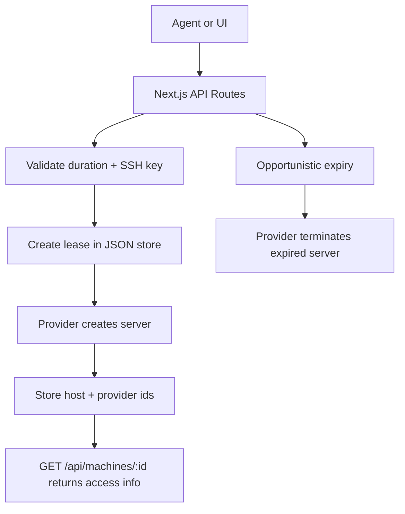

# Agentic Compute Storefront

A small Next.js + TypeScript storefront for leasing one product: a temporary bare Linux machine.

The app is intentionally narrow:

- One product: `bare-linux-machine`
- One request shape: duration plus SSH public key
- One lifecycle: create, poll, terminate, expire
- One local persistence layer: JSON file storage
- One safe default provider: dry-run, which simulates provisioning
- Optional real provider: Hetzner Cloud, enabled explicitly with env vars

## Run

```bash
npm install
npm run dev
```

Open `http://localhost:3000`.

Useful env vars:

```bash
DATA_PATH=data/machines.json
PROVIDER=dry-run
```

To use Hetzner for real provisioning:

```bash
PROVIDER=hetzner
HETZNER_API_TOKEN=...
npm run dev
```

The Hetzner adapter is configured for a small Ubuntu machine:

- Server type: `cx22`
- Image: `ubuntu-24.04`
- Location: `fsn1`
- Access: the provided SSH public key is attached at provision time

The next hardening step is to attach a per-lease firewall that allows inbound SSH and denies other inbound traffic.

## API

Create a machine:

```bash
curl -s http://localhost:3000/api/machines \
  -H 'content-type: application/json' \
  -d '{
    "duration_minutes": 60,
    "ssh_public_key": "ssh-ed25519 AAAAC3NzaC1lZDI1NTE5AAAAIExampleKey user@example"
  }'
```

Get machine status:

```bash
curl -s http://localhost:3000/api/machines/<machine_id>
```

Terminate early:

```bash
curl -X DELETE -s http://localhost:3000/api/machines/<machine_id>
```

Expire due leases:

```bash
curl -X POST -s http://localhost:3000/api/machines/expire
```

Health check:

```bash
curl -s http://localhost:3000/api/health
```

## Architecture



There is no required resident worker. Expiry runs opportunistically during create/get flows and can also be triggered through `POST /api/machines/expire`, which is suitable for a cron job later.

The agent never receives cloud-provider credentials. It only receives the leased machine host and SSH command.

## Tests

```bash
npm run typecheck
npm test
npm run build
```

