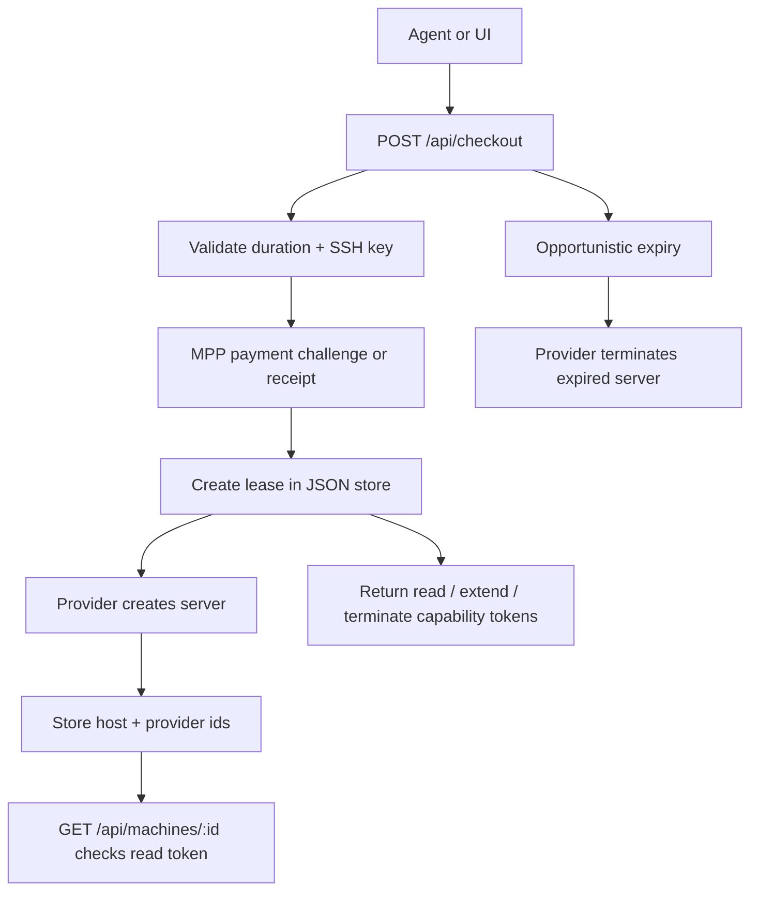

# Agentic Compute Storefront

A small Next.js + TypeScript storefront for leasing one product: a temporary bare Linux machine.

The app is intentionally narrow:

- One product: `bare-linux-machine`
- One request shape: duration plus SSH public key
- One paid checkout flow: MPP `402 Payment Required`, then provision after payment
- One lifecycle: create, poll, extend, terminate, expire
- Resource-scoped lease capability tokens for management
- One local persistence layer: JSON file storage
- One safe default provider: dry-run, which simulates provisioning
- Optional real provider: Hetzner Cloud, enabled explicitly with env vars

## Run

```bash
bun install
bun run dev
```

Open `http://localhost:3000`.

Useful env vars:

```bash
DATA_PATH=data/machines.json
LEASE_STORE=file
PROVIDER=dry-run
ALLOW_UNPAID_MACHINE_CREATE=false
ALLOW_TEST_PAYMENTS_WITH_REAL_PROVIDER=false
CRON_SECRET=replace-with-random-secret
MPP_SECRET_KEY=replace-with-random-base64-secret
STRIPE_SECRET_KEY=sk_test_...
STRIPE_PROFILE_ID=profile_test_...
STRIPE_PAYMENT_METHOD_TYPES=card,link
CHECKOUT_BASE_FEE_CENTS=99
PRICE_CENTS_PER_MINUTE=5
```

For Vercel or any serverless deployment that provisions real infrastructure, use durable storage instead of the local JSON file:

```bash
LEASE_STORE=redis-rest
REDIS_REST_URL=https://...
REDIS_REST_TOKEN=...
REDIS_REST_KEY=checkout-proto:leases
```

`LEASE_STORE=file` is for local development and tests. The app refuses to run real providers in `NODE_ENV=production` with the file store because Vercel function filesystems are not durable application storage.

Generate `MPP_SECRET_KEY` with:

```bash
openssl rand -base64 32
```

Paid checkout is exposed at `POST /api/checkout`. It follows the MPP pattern used by agentic checkout examples such as PostalForm and Prospect Butcher Co.: submit the order details, receive an HTTP `402` payment challenge if no credential is present, retry with a Stripe-backed MPP payment credential, and then receive the fulfilled resource.

For Stripe SPT/card-style MPP payments, create a Stripe profile in the Dashboard and set `STRIPE_PROFILE_ID` to the `profile_test_...` value in test mode or the `profile_...` value in live mode. Use a matching `STRIPE_SECRET_KEY`: `sk_test_...` for sandbox checkout, `sk_live_...` for real payments. The default accepted SPT-backed payment methods are `card,link`.

Recommended agent payment path is Stripe Link CLI using an MPP Shared Payment Token. Current Link CLI versions require the agent to decode the `402` challenge, create an approved spend request, then pay the endpoint:

```bash
npx @stripe/link-cli mpp decode \
  --challenge '<WWW-Authenticate Payment challenge>'

npx @stripe/link-cli payment-methods list

npx @stripe/link-cli spend-request create \
  --payment-method-id <payment_method_id> \
  --credential-type shared_payment_token \
  --network-id <network_id_from_challenge> \
  --amount 399 \
  --currency usd \
  --context "Checkout a 60 minute bare Linux machine lease on behalf of the owner. The lease is temporary, costs $3.99, and will be terminated when the task is complete." \
  --line-item "name:60 minute bare Linux machine lease,unit_amount:399,quantity:1" \
  --total "type:total,display_text:Total,amount:399" \
  --request-approval

npx @stripe/link-cli mpp pay http://localhost:3000/api/checkout \
  --spend-request-id <approved_spend_request_id> \
  --method POST \
  --header 'Content-Type: application/json' \
  --data '{"duration_minutes":60,"ssh_public_key":"ssh-ed25519 ..."}'
```

For Stripe sandbox testing, keep the same MPP flow and use matching test-mode Stripe settings:

```bash
PROVIDER=dry-run
STRIPE_SECRET_KEY=sk_test_...
STRIPE_PROFILE_ID=profile_test_...
```

By default, Stripe test-mode payments are blocked when `PROVIDER=hetzner` because they would create real billable servers without collecting real payment. For a tightly controlled infrastructure test only, explicitly set:

```bash
ALLOW_TEST_PAYMENTS_WITH_REAL_PROVIDER=true
```

When the decoded challenge `network_id` starts with `profile_test_`, add `--test` to `npx @stripe/link-cli spend-request create`. This provisions a test Shared Payment Token while still exercising the same `402` and `Authorization: Payment` checkout path used in production.

Any MPP client that can create a Stripe SPT for the advertised challenge and retry with `Authorization: Payment ...` should work. Link CLI virtual cards and manual card entry are not supported because this storefront exposes an agentic MPP endpoint, not a browser card checkout form. Crypto MPP is intentionally not accepted.

Checkout is subject to [acceptable use](ACCEPTABLE_USE.md), also served for live agents at `/acceptable-use`. Machines are for lawful, authorized development, automation, testing, debugging, and compute tasks. Do not use leased machines for spam, phishing, unauthorized scanning or exploitation, denial-of-service activity, malware, botnets, cryptojacking, cryptocurrency mining, illegal content, sanctions evasion, or platform safety bypasses.

To use Hetzner for real provisioning:

```bash
PROVIDER=hetzner
HETZNER_API_TOKEN=...
LEASE_STORE=redis-rest
REDIS_REST_URL=...
REDIS_REST_TOKEN=...
bun run dev
```

The Hetzner adapter is configured for a small EU Ubuntu machine:

- Server type: `cx23`
- Image: `ubuntu-24.04`
- Location: `fsn1` in Falkenstein, Germany
- Access: the provided SSH public key is attached at provision time
- Network hardening: each lease gets a Hetzner Cloud Firewall allowing inbound TCP/22 from IPv4/IPv6 and denying other inbound traffic

Provisioning is completed before checkout returns. If Hetzner creation fails after a partial resource was created, the app attempts to clean up the server, SSH key, and firewall before marking the lease failed.

## API

Agent discovery:

```bash
curl -s http://localhost:3000/llms.txt
curl -s http://localhost:3000/.well-known/agent-storefront.json
curl -s http://localhost:3000/openapi.json
```

Paid checkout for a machine:

```bash
curl -i http://localhost:3000/api/checkout \
  -H 'content-type: application/json' \
  -d '{
    "duration_minutes": 60,
    "ssh_public_key": "ssh-ed25519 AAAAC3NzaC1lZDI1NTE5AAAAIExampleKey user@example"
  }'
```

Without an MPP credential, the response is `402 Payment Required` with `WWW-Authenticate` payment challenges. Retry the same request with a valid MPP payment credential to receive:

```json
{
  "checkout": {
    "status": "paid",
    "quote": {
      "product_id": "bare-linux-machine",
      "duration_minutes": 60,
      "base_fee_cents": 99,
      "unit_price_cents_per_minute": 5,
      "amount_cents": 399,
      "amount": "3.99",
      "currency": "usd"
    }
  },
  "machine": {
    "machine_id": "machine_...",
    "management": {
      "read_token": "mt_read_...",
      "extend_token": "mt_extend_...",
      "terminate_token": "mt_term_..."
    }
  }
}
```

The unpaid local/dev provisioning endpoint remains available only when `PROVIDER=dry-run` or `ALLOW_UNPAID_MACHINE_CREATE=true`:

```bash
curl -s http://localhost:3000/api/machines \
  -H 'content-type: application/json' \
  -d '{
    "duration_minutes": 60,
    "ssh_public_key": "ssh-ed25519 AAAAC3NzaC1lZDI1NTE5AAAAIExampleKey user@example"
  }'
```

Get machine status:

```bash
curl -s http://localhost:3000/api/machines/<machine_id> \
  -H 'authorization: Bearer <read_token>'
```

Extend a machine:

```bash
curl -X POST -s http://localhost:3000/api/machines/<machine_id>/extend \
  -H 'authorization: Bearer <extend_token>' \
  -H 'content-type: application/json' \
  -d '{"additional_minutes": 15}'
```

Terminate early:

```bash
curl -X DELETE -s http://localhost:3000/api/machines/<machine_id> \
  -H 'authorization: Bearer <terminate_token>'
```

Expire due leases:

```bash
curl -s http://localhost:3000/api/machines/expire \
  -H 'authorization: Bearer <cron_secret>'
```

Health check:

```bash
curl -s http://localhost:3000/api/health
```

## Architecture



There is no required resident worker. Expiry runs opportunistically during create/get flows and through `GET /api/machines/expire`, which is scheduled in `vercel.json` as a Vercel Cron job every five minutes.

Vercel Cron invokes the configured path with an HTTP `GET` request and sends `CRON_SECRET` as `Authorization: Bearer <secret>`. Set `CRON_SECRET` in Vercel before deploying. The bundled five-minute cron requires a Vercel plan that supports that frequency; Hobby plans allow only daily cron, so timely real-server expiry needs a paid Vercel plan or a separate external scheduler.

The JSON store is useful for local prototyping. Real Vercel usage should set `LEASE_STORE=redis-rest` and point `REDIS_REST_URL` / `REDIS_REST_TOKEN` at durable Redis-compatible storage.

The agent never receives cloud-provider credentials. It receives only the leased machine host, SSH command, and resource-scoped capability tokens for that lease. Raw tokens are returned once at create time and stored hashed at rest.

Agents should start with `/llms.txt` for terse operating instructions, then use `/.well-known/agent-storefront.json` or `/openapi.json` for machine-readable endpoint details.

## Tests

```bash
bun run typecheck
bun test
bun run build
```
