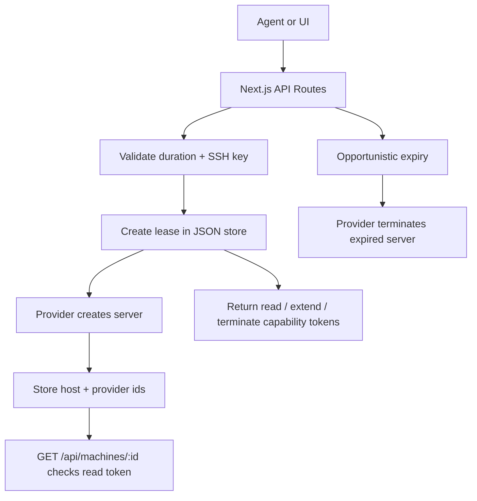

# Agentic Compute Storefront

A small Next.js + TypeScript storefront for leasing one product: a temporary bare Linux machine.

The app is intentionally narrow:

- One product: `bare-linux-machine`
- One request shape: duration plus SSH public key
- One lifecycle: create, poll, extend, terminate, expire
- Resource-scoped lease capability tokens for management
- One local persistence layer: JSON file storage
- One safe default provider: dry-run, which simulates provisioning
- Optional real provider: Hetzner Cloud, enabled explicitly with env vars

## Run

```bash
bun install
bun run dev
```

Open `http://localhost:3000`.

Useful env vars:

```bash
DATA_PATH=data/machines.json
PROVIDER=dry-run
CRON_SECRET=replace-with-random-secret
```

To use Hetzner for real provisioning:

```bash
PROVIDER=hetzner
HETZNER_API_TOKEN=...
bun run dev
```

The Hetzner adapter is configured for a small Ubuntu machine:

- Server type: `cx22`
- Image: `ubuntu-24.04`
- Location: `fsn1`
- Access: the provided SSH public key is attached at provision time

The next hardening step is to attach a per-lease firewall that allows inbound SSH and denies other inbound traffic.

## API

Agent discovery:

```bash
curl -s http://localhost:3000/llms.txt
curl -s http://localhost:3000/.well-known/agent-storefront.json
curl -s http://localhost:3000/openapi.json
```

Create a machine:

```bash
curl -s http://localhost:3000/api/machines \
  -H 'content-type: application/json' \
  -d '{
    "duration_minutes": 60,
    "ssh_public_key": "ssh-ed25519 AAAAC3NzaC1lZDI1NTE5AAAAIExampleKey user@example"
  }'
```

Get machine status:

```bash
curl -s http://localhost:3000/api/machines/<machine_id> \
  -H 'authorization: Bearer <read_token>'
```

Extend a machine:

```bash
curl -X POST -s http://localhost:3000/api/machines/<machine_id>/extend \
  -H 'authorization: Bearer <extend_token>' \
  -H 'content-type: application/json' \
  -d '{"additional_minutes": 15}'
```

Terminate early:

```bash
curl -X DELETE -s http://localhost:3000/api/machines/<machine_id> \
  -H 'authorization: Bearer <terminate_token>'
```

Expire due leases:

```bash
curl -s http://localhost:3000/api/machines/expire \
  -H 'authorization: Bearer <cron_secret>'
```

Health check:

```bash
curl -s http://localhost:3000/api/health
```

## Architecture



There is no required resident worker. Expiry runs opportunistically during create/get flows and through `GET /api/machines/expire`, which is scheduled in `vercel.json` as a Vercel Cron job every five minutes.

Vercel Cron invokes the configured path with an HTTP `GET` request and sends `CRON_SECRET` as `Authorization: Bearer <secret>`. Set `CRON_SECRET` in Vercel before deploying. Hobby plans currently allow cron jobs only once per day, so timely lease expiry needs a paid plan or a different scheduler.

The JSON store is useful for local prototyping. Before real Vercel production usage, move leases and capability token hashes to durable storage such as Postgres, Redis, or Vercel KV.

The agent never receives cloud-provider credentials. It receives only the leased machine host, SSH command, and resource-scoped capability tokens for that lease. Raw tokens are returned once at create time and stored hashed at rest.

Agents should start with `/llms.txt` for terse operating instructions, then use `/.well-known/agent-storefront.json` or `/openapi.json` for machine-readable endpoint details.

## Tests

```bash
bun run typecheck
bun test
bun run build
```
